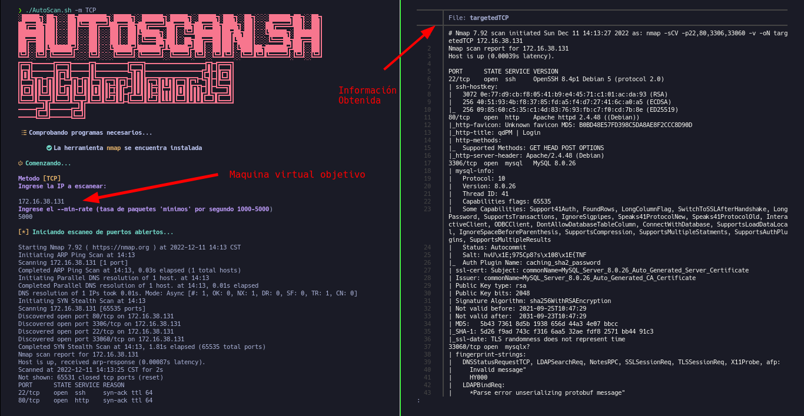

#Instalación
*Cada modo escanea y genera archivos con la información*
```
git clone https://github.com/CyberDemonWH19/AutoScan.sh.git

```


##Uso:
*Como root*
```
./AutoScan.sh -m TCP
```
*Con sudo*
*Ejemplo con el modo TCP*

```
sudo ./AutoScan.sh -m TCP
```

**Esto es una pequeña herramienta hecha en bash, esta en español.**
 
